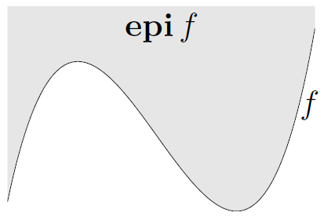

# L3_Convex functions

## basic properties and examples

- Examples on $\mathbb{R}$ convex: affine, exponential, powers($x^\alpha$, $\alpha\geq1$ or $\alpha\leq 0$), powers of absolute value($|x|^p, p\geq1$), negative entropy($x\log x$)
- Examples on $\mathbb{R}$ concave: affine, powers($x^\alpha$, $0\leq\alpha\leq1$), logarithm($\log x$)
- Examples on $\mathbb{R}^n$ and $\mathbb{R}^{m\times n}$: affine functions are convex and concave; all norms (spectral norm on $\mathbb{R}^{m\times n}$) are convex
- First-order condition: $f(y)\geq f(x)+\nabla f(x)^T(y-x), \forall x,y$
- Second-order conditions: $\nabla^2 f(x)\geq0,\forall x$
- $\alpha$-sub-level set of $f$: $\{x|f(x)\leq\alpha\}$, sub-level sets of convex functions are convex (converse is false)
- epigraph of $f$ ($\mathbb{R}^n\to\mathbb{R}$): $\mathbf{epi} f=\{(x,t)\in\mathbb{R}^{n+1}|x\in\mathbf{dom}f,f(x)\leq t\}$, $f$ is convex if and only if $\mathbf{epi} f$ is a convex set

## operations that preserve convexity

- Positive weighted sum: $\alpha_1f_1+\alpha_2f_2$$\alpha_1f_1+\alpha_2f_2$ is convex if $f_1,f_2$ is convex
- composition with affine function: $f(Ax+b)$ is convex if $f$ is convex
- Pointwise maximum: $\max\{f_1,f_2,\dots\}$ is convex if $f_1,f_2,\dots$ is convex (sum of $r$ largest components of $x\in\mathbb{R}^n$)
- Pointwise supermum: $g(x)=\sup_{y\in A}f(x,y)$ is convex if $f(x,y)$ is convex in $x$ for each $y\in A$ ($\sup_{y\in C}\|x-y\|,\sup_{\|y\|_2=1}y^TXy$)
- Composition with scalar functions: $f(x)=h(g(x)),g:\mathbb{R}^n\to\mathbb{R},h:\mathbb{R}\to\mathbb{R}$ is convex if $f''(x)=h''(g(x))g'(x)^2+h'(g(x))g''(x)\geq0$ such as $g$ convex, $h$ convex, $h$ nondecreasing ($\exp g(x),1/g(x)$)
- Vector composition: $f(x)=h(g_1(x),g_2(x),\dots),g_i:\mathbb{R}^n\to\mathbb{R},h:\mathbb{R}^k\to\mathbb{R}$ ($\sum\log g_i(x)$ is concave if $g_i(x)$ are concave, $\log\sum\exp g_i(x)$ is convex if $g_i(x)$ are convex)
- Minimization: $g(x)=\inf_{y\in C}f(x,y)$ is convex if $f(x,y)$ is convex in $(x,y)$ and $C$ is a convex set
- Perspective: $g(x,t)=tf(x/t),\mathbf{dom}g=\{(x,t)|x/t\in\mathbf{dom}f,t>0\}$ is convex if $f$ is convex

$\log\sum\exp$ is a soft max, an analytic or smooth approximation of the max function

## the conjugate function

- the conjugate of a function $f$ is $f^*(y)=\sup_{x\in\mathbf{dom}f}(y^Tx-f(x))$, $f^*$ is convex even if $f$ is not (generalization of pointwise supermum)

## quasiconvex functions

- $f:\mathbb{R}^n\to\mathbb{R}$ is quasi-convex if $\mathbf{dom}f$ is convex and the sub-level sets $S_\alpha=\{x\in\mathbf{dom}f|f(x)\leq\alpha\}$ are convex for all $\alpha$
- $f$ is quasi-concave if $−f$ is quasi-convex
- $f$ is quasi-linear if it is quasi-convex and quasi-concave
- modified Jensen inequality: for quasi-convex $f(\theta x+(1-\theta)y)\leq\max\{f(x),f(y)\}$

## log-concave and log-convex functions

- a positive function $f$ is log-concave if $\log f$ is concave, $f$ is log-convex if $\log f$ is convex: $f(\theta x+(1-\theta) y) \geq f(x)^\theta f(y)^{1-\theta}$
- twice differentiable $f$ with convex domain is log-convex if and only if $f(x)\nabla^2f(x)\geq\nabla f(x)\nabla f(x)^T,\forall x\in\mathbf{dom}f$ and vice versa
- product of log-concave functions is log-concave
- sum of log-concave functions is not always log-concave
- integration: if $f$ is log-concave, then $g(x)=\int f(x,y)\mathbf{d}y$ is log-concave

$$
\nabla^2 \log f(x)=\frac{1}{f(x)} \nabla^2 f(x)-\frac{1}{f(x)^2} \nabla f(x) \nabla f(x)^T
$$

## convexity with respect to generalized inequalities

- $f$ is K-convex if $\mathbf{dom}f$ is convex and $f(\theta x+(1-\theta)y)\leq_K\theta f(x)+(1-\theta)f(y)$