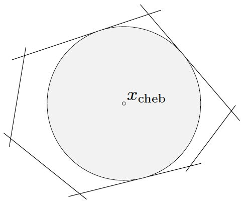

# L4_Convex optimization problems

## optimization problem in standard form

## convex optimization problems

- introducing slack variables for linear inequalities: $a_i^Tx\leq b_i\Longrightarrow a_i^Tx+s_i=b_i,s_i\geq0$

## quasi-convex optimization

## linear optimization

- piecewise-linear minimization: $\min\max\{a_i^Tx+b_i\}\Longrightarrow\min t,a_i^Tx+b_i\leq t$
- Chebyshev center of a polyhedron: Chebyshev center of $a_i^Tx\leq b_i$ is center of largest inscribed ball $\{x_c+u|\|u\|_2\leq r\}\Longrightarrow\max r,a_i^Tx_c+r\|a_i\|_2\leq b_i$
- Linear-fractional program: $\min (c^Tx+d)/(e^Tx+f),Gx\leq h,Ax=b\Longrightarrow\min c^Ty+dz,Gy\leq hz,Ay=bz,e^Ty+fz=1,z\geq0$

## quadratic optimization

## geometric programming

- monomial function: $f(x)=cx_1^{a_1}\cdots x_n^{a_n}$
- posynomial function: sum of monomials $f(x)=\sum_{k=1}^Kc_kx_1^{a_{1k}}\cdots x_n^{a_{nk}}$
- geometric program (GP): $\min f_0(x),f_i(x)\leq1,h_i(x)=1$, with $f_i$ posynomial, $h_i$ monomial
- Geometric program in convex form: change variables to $y_i = \log x_i$, and take logarithm of cost, constraints

## generalized inequality constraints

## semidefinite programming

## vector optimization